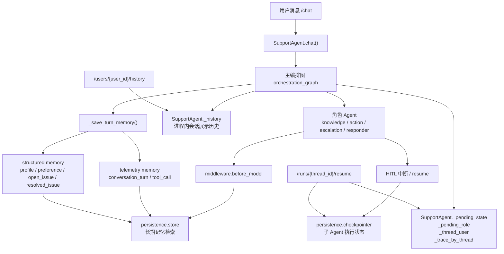

# 当前 Memory 架构

## 设计目标

当前项目已经统一到一套实际生效的记忆方案，不再保留旧版 `ConversationMemory` / `UserMemoryStore` 双实现。

目标分为三层：

- 线程级可恢复执行：支撑 HITL 中断、子 Agent 恢复执行
- 用户级长期记忆：沉淀偏好、身份信息、未解决问题等可复用事实
- 进程内展示状态：提供 `/history`、trace、待恢复上下文等轻量运行态信息

## 架构图

## 各层职责

### 1. `persistence.store`

文件：

- `src/conversation/support_agent/persistence.py`
- `src/conversation/support_agent/service.py`
- `src/conversation/support_agent/middleware.py`

职责：

- 保存长期记忆
- 支持按用户维度检索结构化记忆
- 在角色 Agent 调模型前注入相关记忆

当前写入的两类数据：

- `telemetry`
  - 会话轮次摘要
  - 工具调用记录
- `structured`
  - `profile:*`
  - `preference:*`
  - `open_issue:*`
  - `resolved_issue:*`

说明：

- 这是当前项目里“真正的长期 memory”
- 若开启 Postgres 持久化，可跨进程、跨重启保留
- 若退化为 `InMemoryStore`，则只在当前进程内有效

### 2. `persistence.checkpointer`

文件：

- `src/conversation/support_agent/persistence.py`
- `src/conversation/support_agent/middleware.py`

职责：

- 为角色子 Agent 提供 LangGraph/LangChain 执行恢复能力
- 支撑 HITL 审批后继续执行同一个角色 Agent 线程

说明：

- 当前 `checkpointer` 接在角色 Agent 上
- 主编排图 `orchestration_graph` 本身没有单独挂 `checkpointer`
- 所以它解决的是“子 Agent 执行恢复”，不是整个主图状态的全量持久化

### 3. `SupportAgent` 进程内状态

文件：

- `src/conversation/support_agent/service.py`

关键字段：

- `_history`
- `_pending_state`
- `_pending_role`
- `_thread_user`
- `_trace_by_thread`
- `_memory_debug_by_thread`

职责：

- 存放 `/history` 展示用历史消息
- 存放当前进程内的待审批上下文
- 存放 trace/debug 信息

说明：

- 这是运行时状态，不属于长期记忆
- 服务重启后会丢失
- 当前 `resume` 仍然依赖这部分状态，因此它还不是“主图完全跨重启恢复”

## 当前统一后的结论

项目现在只有一套有效 memory 方案：

- 长期记忆：`persistence.store`
- 子 Agent 恢复：`persistence.checkpointer`
- 轻量运行态状态：`SupportAgent` 进程内字典

已删除的旧方案：

- `src/memory/conversation_memory.py`
- `tests/unit/test_conversation_memory.py`

## 面试时可以怎么讲

可以直接说：

> 这个项目我最终统一成了一套真实生效的 memory 架构。长期记忆通过 LangGraph store 管理，保存用户偏好、身份信息和 open issue；HITL 恢复依赖角色 Agent 的 checkpointer；另外保留一层进程内轻量状态做 history 展示和待审批上下文。这样职责分层更清晰，也避免了项目里同时存在两套 conversation memory 实现带来的认知混乱。
