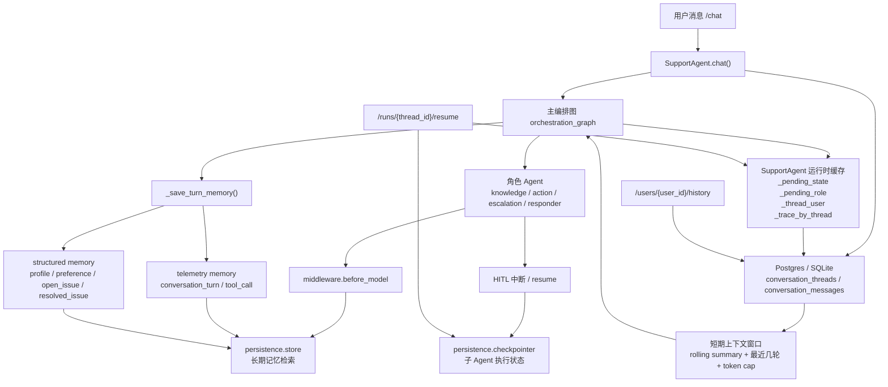

# 当前 Memory 架构

## 设计目标

当前项目已经统一到一套实际生效的记忆方案，不再保留旧版 `ConversationMemory` / `UserMemoryStore` 双实现。

目标分为三层：

- 线程级短期记忆：保存原始 transcript，支撑最近几轮上下文注入与历史查询
- 线程级可恢复执行：支撑 HITL 中断、子 Agent 恢复执行
- 用户级长期记忆：沉淀偏好、身份信息、未解决问题等可复用事实

## 架构图

## 各层职责

### 1. `persistence.store`

文件：

- `src/conversation/support_agent/persistence.py`
- `src/conversation/support_agent/service.py`
- `src/conversation/support_agent/middleware.py`

职责：

- 保存长期记忆
- 支持按用户维度检索结构化记忆
- 在角色 Agent 调模型前注入相关记忆

当前写入的两类数据：

- `telemetry`
  - 会话轮次摘要
  - 工具调用记录
- `structured`
  - `profile:*`
  - `preference:*`
  - `open_issue:*`
  - `resolved_issue:*`

说明：

- 这是当前项目里“真正的长期 memory”
- 若开启 Postgres 持久化，可跨进程、跨重启保留
- 若退化为 `InMemoryStore`，则只在当前进程内有效

### 2. `persistence.checkpointer`

文件：

- `src/conversation/support_agent/persistence.py`
- `src/conversation/support_agent/middleware.py`

职责：

- 为角色子 Agent 提供 LangGraph/LangChain 执行恢复能力
- 支撑 HITL 审批后继续执行同一个角色 Agent 线程

说明：

- 当前 `checkpointer` 接在角色 Agent 上
- 主编排图 `orchestration_graph` 本身没有单独挂 `checkpointer`
- 所以它解决的是“子 Agent 执行恢复”，不是整个主图状态的全量持久化

### 3. `conversation_threads` / `conversation_messages`

文件：

- `src/db/models.py`
- `src/db/repositories.py`
- `src/conversation/support_agent/service.py`
- `src/conversation/support_agent/graph.py`

职责：

- 保存用户可见的原始对话历史 transcript
- 以 `thread_id` 维度构造短期上下文窗口
- 在长线程下生成 `rolling_summary`
- 持久化待审批状态（`pending_role` / `pending_state` / `trace_id`）
- 为 `/users/{user_id}/history` 提供稳定的数据库查询结果

当前策略：

- 数据库存完整 transcript
- 主图提示词只注入最近几轮对话
- 注入时同时受“最近轮数 / 最大消息数 / token 上限”限制
- 当前默认参数：
  - `conversation_recent_turns = 6`
  - `conversation_context_messages = 12`
  - `conversation_context_tokens = 2000`
  - `conversation_summary_trigger_messages = 16`
  - `conversation_summary_refresh_interval = 6`

说明：

- 这是当前项目里“真正的短期 memory”
- 与长期记忆不同，它保存的是原始消息，而不是提炼后的事实
- 服务重启后历史不会丢失
- 若线程被 HITL 中断，`resume` 所需的待审批状态也会写回线程表，尽量减少对进程内缓存的依赖

### 4. `SupportAgent` 进程内状态

文件：

- `src/conversation/support_agent/service.py`

关键字段：

- `_pending_state`
- `_pending_role`
- `_thread_user`
- `_trace_by_thread`
- `_memory_debug_by_thread`

职责：

- 存放当前进程内的待审批上下文
- 存放 trace/debug 信息

说明：

- 这是运行时状态，不属于长期记忆
- 服务重启后会丢失
- 当前优先从数据库恢复待审批上下文，进程内状态退化为加速缓存
- 因此 `resume` 已不再只依赖单进程内存，但主图本身仍不是完整的全量跨重启恢复

## 当前统一后的结论

项目现在只有一套有效 memory 方案：

- 短期记忆：业务数据库中的 transcript 表
- 长期记忆：`persistence.store`
- 子 Agent 恢复：`persistence.checkpointer`
- 轻量运行态状态：`SupportAgent` 进程内字典

已删除的旧方案：

- `src/memory/conversation_memory.py`
- `tests/unit/test_conversation_memory.py`

## 面试时可以怎么讲

可以直接说：

> 这个项目我把 memory 明确拆成了三层。短期记忆用关系数据库保存原始 transcript，并用 rolling summary + 最近几轮窗口控制上下文长度；长期记忆通过 LangGraph store 管理，保存用户偏好、身份信息和 open issue；HITL 恢复则同时结合线程表里的待审批状态和角色 Agent 的 checkpointer。这样 transcript、semantic memory 和 execution state 三类职责被清晰拆开了。
